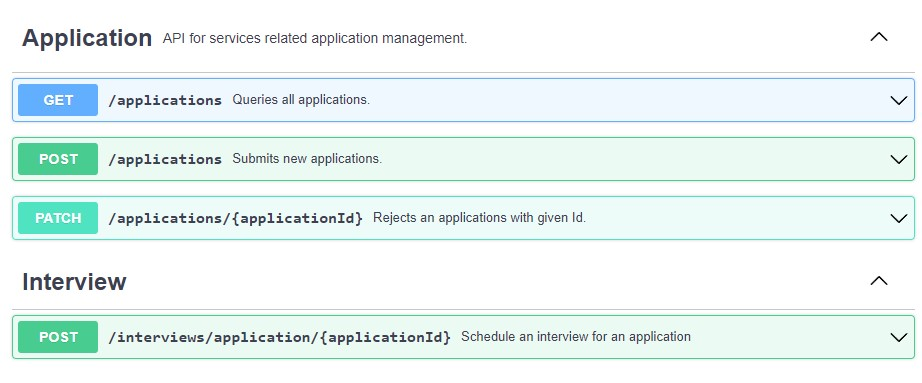

# Manatee API

The following API was done as a solution for Cybernetica 2023 Internship test task and does not provide any meaningful functionalities.

## Getting started

This project requires Java 17 or a newer version to be installed on the machine.
For developers, Amazon Coretta or Eclipse Termium are recommended JDKs.

For development purposes only, the relational H2 database is initialized in the local runtime.
On the shutdown, the database is torn down. There is no other option to set a persistent database.

### For Linux users (bash)

```bash
./gradlew build # Generates OpenAPI models, builds the application and runs tests.
./gradlew bootRun # Starts the application on a local network. 
```

### For Windows users

```bash
gradlew build # Generates OpenAPI models, builds the application and runs tests.
gradlew bootRun # Starts the application on a local network. 
```


# Summary
| Question                                 | Answer |
|------------------------------------------|--------|
| Time  spent (h)                          | ~8h     |
| Hardest task, (with reasoning)           | - Application and Interview entities relation (Had to try multiple implementation variations before I got everything working as it is intended to work, that step was the most time-consuming)     |
| Uncompleted tasks, if any                | -      |
| Additional dependencies (with reasoning) | -      | 

I appreciated the uniqueness of the assessment in contrast to the other evaluations I've completed. I also enjoyed that I did not need to start the project from scratch. It was my first time working with state management and the first time I encounter an assessment that involves working with OpenAPI generation. I needed to do some research on those technologies before I could come up with a solution, resulting in the acquisition of new experience.
It was nice to be able to comple the bonus task as well :)

# OpenAPI Specification



```
openapi: 3.0.3
info:
  title: Manatee API
  version: 1.0.0
  description: |
    Candidate application management API codenamed "Manatee" is a mockup of a real system,
    where recruiters can view new applications and follow a process until successful onboarding.  
servers:
  - url: http://localhost:8080/
    description: Local development server

externalDocs:
  url: https://swagger.io/specification/
  description: Find more information about OAS3.0 standard.

tags:
  - name: Application
    description: API for services related application management.

paths:
  /applications:
    get:
      operationId: getApplications
      tags:
        - Application
      summary: Queries all applications.
      description: Selects all applications stored in database and returns them as an array.
      responses:
        '200':
          description: Successful query returns an array of applications.
          content:
            application/json:
              schema:
                type: array
                items:
                  $ref: '#/components/schemas/Application'
    post:
      operationId: addApplication
      tags:
        - Application
      summary: Submits new applications.
      description: Submits a new applications and instantiates it with a new state.
      requestBody:
        description: A new application information.
        content:
          application/json:
            schema:
              $ref: '#/components/schemas/Application'
      responses:
        '201':
          description: Successfully submitted applications returns an instance with given id.
          content:
            application/json:
              schema:
                $ref: '#/components/schemas/Application'
  /applications/{applicationId}:
    patch:
      operationId: rejectApplication
      tags:
        - Application
      summary: Rejects an applications with given Id.
      description: Find the applications and performs a state transition to rejected state.
      parameters:
        - $ref: '#/components/parameters/ApplicationId'
      responses:
        '202':
          description: Application rejection was accepted and state transition was successful.
  /interviews/application/{applicationId}:
    post:
      operationId: scheduleInterview
      tags:
        - Interview
      summary: Schedule an interview for an application
      description: Schedules a new interview time for an application if the application's state allows to do so.
      parameters:
        - $ref: '#/components/parameters/ApplicationId'
      requestBody:
        description: A new interview information.
        content:
          application/json:
            schema:
              $ref: '#/components/schemas/Interview'
      responses:
        '201':
          description: Successfully submitted interviews returns an instance with given id.
          content:
            application/json:
              schema:
                $ref: '#/components/schemas/Interview'
        '400':
          description: Bad Request
        '500':
          description: Internal Server Error


components:
  schemas:
    Application:
      type: object
      required:
        - candidate
      properties:
        id:
          type: integer
        applicationState:
          $ref: '#/components/schemas/ApplicationState'
        candidate:
          $ref: '#/components/schemas/Candidate'
        interview:
          $ref: '#/components/schemas/Interview'
        updatedOn:
          type: string
          format: date-time

    Candidate:
      type: object
      required:
        - firstName
        - lastName
      properties:
        id:
          type: integer
        firstName:
          type: string
        lastName:
          type: string

    Interview:
      type: object
      required:
        - interviewDateTime
      properties:
        id:
          type: integer
        interviewDateTime:
          type: string
          format: date-time
          description: Date and time of the scheduled interview.

    ApplicationState:
      type: string
      enum:
        - New
        - Interview
        - Offer
        - Pre-onboard
        - Hired
        - Rejected

  parameters:
    ApplicationId:
      name: applicationId
      in: path
      description: ID of application to use
      required: true
      schema:
        type: integer
```
